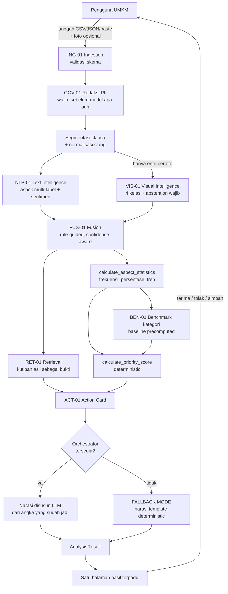
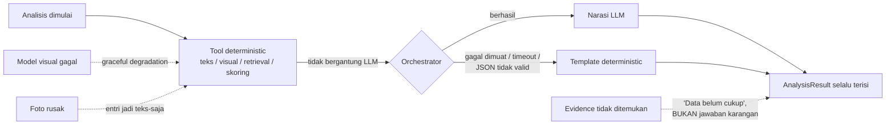
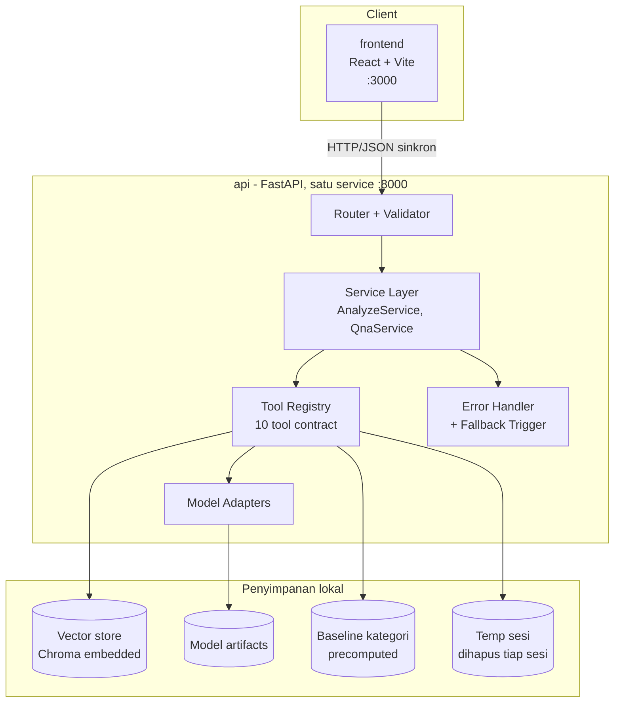
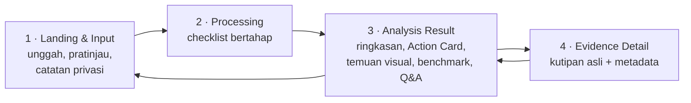

# InsightUlasan

**Mengubah tumpukan ulasan dan foto pelanggan UMKM berbahasa Indonesia informal menjadi tiga masalah paling mendesak, bukti kutipan aslinya, dan langkah konkret yang bisa langsung dikerjakan - dalam satu kali unggah.**

Subtema: Smart Commerce · Seluruh model berjalan lokal, CPU-friendly, tanpa API berbayar · Setiap rekomendasi wajib persetujuan manusia

---

## Daftar isi

1. [Ringkasan](#1-ringkasan)
2. [Status pengembangan](#2-status-pengembangan)
3. [Masalah dan mengapa AI diperlukan](#3-masalah-dan-mengapa-ai-diperlukan)
4. [Alur kerja sistem end-to-end](#4-alur-kerja-sistem-end-to-end)
5. [Arsitektur](#5-arsitektur)
6. [Kontrak data dan API](#6-kontrak-data-dan-api)
7. [Antarmuka pengguna](#7-antarmuka-pengguna)
8. [Alur kerja pengembangan](#8-alur-kerja-pengembangan)
9. [Menjalankan yang sudah ada](#9-menjalankan-yang-sudah-ada)
10. [Dataset dan lisensi](#10-dataset-dan-lisensi)
11. [Evaluasi dan batas klaim](#11-evaluasi-dan-batas-klaim)
12. [Keputusan arsitektur](#12-keputusan-arsitektur)
13. [Keterbatasan yang diketahui](#13-keterbatasan-yang-diketahui)
14. [Struktur repositori](#14-struktur-repositori)
15. [Konvensi pengembangan](#15-konvensi-pengembangan)
16. [Dokumentasi lengkap](#16-dokumentasi-lengkap)

---

## 1. Ringkasan

InsightUlasan menjembatani lima tahap berurutan yang selama ini terputus pada perkakas yang tersedia bagi UMKM:

> ulasan mentah → pemahaman aspek & sentimen → penggabungan bukti teks + visual → penentuan prioritas → rekomendasi aksi bisnis dengan bukti yang dapat diverifikasi

**Jembatan lima tahap inilah novelty produk - bukan satu model AI tunggal mana pun.** Dashboard marketplace berhenti di rata-rata rating; sentiment analysis biasa berhenti di label sentimen. Tidak ada yang melanjutkan ke *"jadi minggu ini saya harus mengerjakan apa, dan apa buktinya?"*

Dua sifat yang membentuk hampir semua keputusan teknis di repositori ini:

- **Angka tidak pernah dikarang.** Seluruh frekuensi, persentase, dan skor prioritas dihitung tool deterministic. Foundation model hanya menyusun narasi dari angka yang sudah jadi, dan tidak pernah menghitung sendiri.
- **Sistem tidak boleh gagal total.** Jika model visual gagal, alur turun mulus ke jalur teks-saja. Jika orchestrator gagal dimuat, sistem masuk FALLBACK MODE dan tetap mengeluarkan hasil lengkap dengan narasi template.

## 2. Status pengembangan

Dikerjakan bertahap mengikuti Fase 0–10. Setiap fase punya *acceptance criterion* dan *go/no-go gate* sendiri.

| Fase | Cakupan | Status | Gate |
| --- | --- | --- | --- |
| 0 | Scope freeze - taksonomi aspek, kelas visual, kontrak data | ✅ selesai | **GO** - taksonomi & kelas visual dikunci |
| 1 | Data & baseline - unduh, harmonisasi, split, baseline TF-IDF | ✅ selesai | **GO** - split product-level terverifikasi bersih, baseline tercatat |
| 2 | Model teks - fine-tuning IndoBERT | ✅ selesai | **Sentimen LULUS** (0,730 vs leksikon 0,700 pada label expert); **aspek TIDAK LULUS** - setara leksikon, lihat MODEL_CARD §4.3 |
| 3 | Model visual - zero-shot CLIP, threshold, kalibrasi | ⏸ menunggu data foto | **gate kritis** - go/no-go berbasis selective accuracy aktual |
| 4 | Retrieval & action engine (RET-01, ACT-01) | ✅ selesai | Action Card lolos spot-check anti-generik; RET-01 menolak menjawab saat bukti tak memadai |
| 5 | Backend FastAPI - 6 endpoint, 10 tool contract | 🔄 berjalan | 6 endpoint jalan; orchestrator belum, sistem berjalan di FALLBACK MODE |
| 6 | Frontend React - 4 screen | 🔄 berjalan | 4 layar terbangun; alur penuh terverifikasi lewat API, transisi layar belum diuji di browser |
| 7 | Integrasi - termasuk jalur kegagalan & fallback | ✅ selesai | 16 integration test hijau, mencakup enam jalur wajib bagian 32 |
| 8 | Evaluasi penuh + error analysis | ⬜ belum | metrik tercatat apa adanya |
| 9 | Docker & reproducibility | ⬜ belum | **gate kritis** - fresh clone tanpa cache berhasil |
| 10 | Dokumentasi akhir | ⬜ belum | - |

> ### Yang perlu diketahui pembaca sekarang
>
> **Aplikasi sudah dapat dijalankan.** API, antarmuka web, dan pipeline `ml/` berjalan penuh - lihat [bagian 9](#9-menjalankan-yang-sudah-ada).
>
> **`docker compose` sudah dikonfigurasi, tetapi belum pernah dijalankan sampai selesai.** Docker tidak terpasang di mesin pengembangan, sehingga konfigurasinya baru diperiksa secara statis (sintaks compose, keberadaan seluruh sumber `COPY`, kecocokan jalur di dalam container, endpoint healthcheck). Rinciannya beserta apa yang sudah dan belum diverifikasi ada di [docker/README.md](docker/README.md). Perintahnya ditulis apa adanya dengan catatan itu, bukan disajikan seolah sudah terbukti.
>
> **Tidak ada angka performa yang dikutip sebagai capaian di README ini.** Metrik yang sudah terukur beserta batas penafsirannya ada di [docs/MODEL_CARD.md](docs/MODEL_CARD.md).

## 3. Masalah dan mengapa AI diperlukan

Pemilik UMKM mikro-kecil menerima ulasan dalam volume yang tidak sebanding dengan waktu dan literasi digital yang mereka punya. Pola masalah nyata - ukuran salah, kemasan rusak, respons lambat - terkubur di antara ratusan baris teks yang tidak pernah dibaca sistematis. Foto bukti yang dilampirkan pembeli nyaris tidak pernah ditinjau secara agregat sama sekali.

**Mengapa bukan sekadar keyword search atau baca manual:**

| Alternatif | Mengapa tidak memadai |
| --- | --- |
| Baca manual | Tidak proporsional di atas 50–100 ulasan/bulan - waktu pemilik UMKM adalah kendala utamanya |
| Keyword / rule-based | Bahasa ulasan informal penuh slang, typo, singkatan, dan campuran bahasa daerah; aturan permukaan tidak konsisten menangkapnya |
| Dashboard rating marketplace | Hanya skor rata-rata; tidak mengekstrak aspek, tidak memberi rekomendasi |
| Zero-shot LLM API murni | Gagal syarat kustomisasi, sulit direproduksi tanpa API key, mahal di skala UMKM mikro, tidak konsisten antar run |

Bukti empiris dari data kami sendiri mendukung ini: pada 96.300 klausa ulasan nyata, **baseline berbasis kecocokan permukaan runtuh pada fenomena komposisional** - sentimen campuran, negasi, dan sarkasme - meski menangani typo dan slang dengan baik. Rinciannya di [docs/MODEL_CARD.md](docs/MODEL_CARD.md) §3.1. Inilah celah yang harus ditutup model kontekstual, dan menjadi pembanding yang bermakna, bukan klaim kosong.

**Yang produk ini sengaja BUKAN:** chatbot generik tanpa cakupan · dashboard sentiment analysis biasa · wrapper tipis di atas LLM API · sistem otonom yang mengeksekusi keputusan bisnis · generator materi iklan otomatis.

## 4. Alur kerja sistem end-to-end

### 4.1 Alur utama (satu input → satu output terpadu)



Garis penting pada diagram di atas: **angka dihasilkan `calculate_*`, bukan oleh LLM.** LLM berada di hilir dan hanya menerima angka yang sudah dihitung. Cabang `FALLBACK MODE` bukan jalur error - ia menghasilkan hasil yang datanya identik, hanya bahasanya lebih sederhana.

### 4.2 Delapan kasus fusion teks + visual

Fusion memakai aturan eksplisit yang dapat diaudit baris per baris, bukan neural fusion yang tidak dapat dijelaskan:

| Kasus | Perlakuan |
| --- | --- |
| Teks negatif, foto sejalan | Confidence gabungan tinggi, badge "didukung bukti visual" |
| Teks negatif, foto abstain | Confidence murni dari teks; visual **tidak** menurunkan angka |
| Teks positif, foto menunjukkan masalah | **Contradiction flag** - ditampilkan apa adanya untuk ditinjau manusia |
| Teks & foto bertentangan arah | Sama - sistem tidak pernah memutuskan siapa yang benar |
| Hanya teks | Jalur visual dilewati sepenuhnya, bukan error |
| Hanya foto, teks sangat pendek | Visual diproses; keterbatasan konteks disebut eksplisit di narasi |
| Confidence teks tinggi, visual rendah | Bobot condong ke teks |
| Visual tinggi, teks ambigu | Bobot condong ke visual **hanya untuk kondisi fisik produk** |

`contradiction_flag = true` **selalu** memicu `requires_human_review = true`.

### 4.3 Jalur kegagalan



## 5. Arsitektur

### 5.1 Diagram kontainer



**Maksimal 3 service** (`frontend`, `api`, `vector-store` opsional) - dapat disederhanakan jadi 2 dengan Chroma embedded di proses `api`. Service layer dipecah modular **secara kode**, bukan dipecah jadi kontainer terpisah, supaya reproduksi lokal tetap sederhana.

### 5.2 Lima lapisan AI

| # | Lapisan | Model utama | Fallback | Target |
| --- | --- | --- | --- | --- |
| 1 | Text Intelligence | IndoBERT-base (fine-tuned) | TF-IDF + Logistic Regression | CPU, ~500MB, <2s/100 ulasan |
| 2 | Visual Intelligence | CLIP ViT-B/32 zero-shot (frozen) | SigLIP | CPU, ~600MB, <1s/foto |
| 3 | Retrieval & Evidence | BGE-M3 + Chroma | Multilingual E5-base | CPU, ~1,1GB, <500ms/query |
| 4 | Action Engine | deterministic, **non-AI** | - | <2s |
| 5 | Foundation Orchestrator | SEA-LION (quantized) | Sailor2 / FALLBACK MODE | CPU, ~4–6GB, <5s |

Bentuk kustomisasi yang dipakai mencakup tiga jalur sekaligus: **fine-tuning model pendukung** (teks), **RAG** (evidence grounding), dan **tool calling** (orchestrator memanggil 10 tool).

Model teks dilatih dengan **satu encoder IndoBERT dan dua head terpisah** - head aspek multi-label dan head sentimen 3 kelas. Encoder dibagi karena dua model IndoBERT terpisah akan menghabiskan hampir dua kali anggaran RAM lapisan teks.

### 5.3 Sepuluh tool contract

Satu-satunya sumber angka di seluruh sistem. Orchestrator memanggil tool ini dan menyusun narasi dari hasilnya.

| Tool | Fungsi | Timeout | Wajib? |
| --- | --- | --- | --- |
| `preprocess_reviews()` | Validasi + normalisasi batch mentah | 10s | ya |
| `redact_personal_data()` | Masking PII sebelum model apa pun melihat teks | 5s | ya |
| `classify_text_aspects()` | Aspek + sentimen per klausa | 15s/100 | ya |
| `classify_review_image()` | Klasifikasi visual + abstention | 5s/foto | hanya jika ada foto |
| `retrieve_evidence()` | Kutipan relevan (RAG) | 3s | ya |
| `calculate_aspect_statistics()` | Frekuensi, persentase, tren | 2s | ya |
| `calculate_priority_score()` | Skor prioritas deterministic | 2s | ya |
| `compare_category_baseline()` | Perbandingan ke baseline kategori | 2s | ya |
| `generate_action_recommendations()` | Narasi Action Card | 8s | ya / fallback template |
| `answer_review_question()` | Jawaban Q&A ter-ground | 8s | ya / fallback pesan |

Kegagalan `classify_review_image()` **tidak** menghentikan analisis. Kegagalan dua tool terakhir memicu FALLBACK MODE. Kegagalan tool wajib lainnya menghentikan analisis dengan pesan error yang jelas.

### 5.4 Formula skor prioritas

Bukan perkalian mentah enam faktor - versi final setelah kajian ulang:

```
score = frequency_norm × severity_norm × confidence_norm
        × (1 + 0.3 × recency_norm + 0.2 × benchmark_gap_norm)
```

Seluruh faktor dinormalisasi ke 0–1 sebelum dikalikan, hasil di-scale ke 0–100, lalu dipetakan ke tiga label urgensi. `Business Relevance` sengaja **dihapus** sebagai faktor terpisah karena tumpang tindih dengan Severity. Bobot 0,3 dan 0,2 berstatus **belum divalidasi** - wajib diuji sensitivity ±50% pada Fase 8 sebelum dianggap final.

Jika total ulasan sesi < 15, seluruh Action Card diberi badge "confidence rendah - data terbatas" dan urgensinya dibatasi maksimal "Sedang", supaya sistem tidak terdengar pasti pada data yang terlalu sedikit.

### 5.5 Mode FULL vs FALLBACK

| | FULL | FALLBACK |
| --- | --- | --- |
| Kapan aktif | Orchestrator berhasil dimuat | Otomatis saat LLM gagal / timeout / output tidak valid |
| Narasi Action Card | Disusun LLM | Template deterministic dari **data yang sama** |
| Q&A | Aktif | Nonaktif sementara dengan pesan jelas |
| Skor, statistik, evidence | - | **identik**, tidak ada yang hilang |
| Indikasi ke pengguna | - | Banner "Mode sederhana aktif" |

## 6. Kontrak data dan API

Seluruh pertukaran antar komponen memakai JSON dengan field wajib/opsional/enum yang didefinisikan eksplisit. Tiga belas skema dikunci sejak Fase 0 supaya frontend dapat mulai dengan mock data sebelum backend selesai.

**Skema inti:** `RawReview` · `ProcessedReview` · `ReviewImage` · `TextPrediction` · `VisualPrediction` · `MultimodalEvidence` · `AspectAggregate` · `BenchmarkRecord` · `ActionCard` · `EvidenceCitation` · `AnalysisResult` · `QnARequest/Response` · `ErrorResponse`

**Endpoint Tier 1:**

| Endpoint | Method | Fungsi | Timeout |
| --- | --- | --- | --- |
| `/api/v1/analyze` | POST | Analisis penuh dari batch ulasan | 30s |
| `/api/v1/questions` | POST | Q&A ter-ground pada hasil analisis | 8s |
| `/api/v1/health` | GET | Proses backend hidup | 1s |
| `/api/v1/readiness` | GET | Seluruh model selesai dimuat | 1s |
| `/api/v1/models` | GET | Versi model aktif (reproducibility) | 1s |
| `/api/v1/demo/sample` | GET | Dataset contoh untuk demo | 1s |

Tidak ada autentikasi pada Tier 1 - sesi tunggal, data tidak disimpan permanen.

Contoh `ActionCard` yang dihasilkan (struktur, bukan hasil pengukuran):

```json
{
  "action_id": "ACT-2026-0142",
  "title": "Revisi size chart pada varian M dan L",
  "one_line_summary": "18 dari 52 keluhan ukuran menyebut produk lebih kecil dari ekspektasi",
  "aspect": "ukuran_varian",
  "frequency": 18, "frequency_total": 52,
  "severity": "sedang-tinggi", "confidence": 0.86,
  "evidence_quotes": ["review_id: 482", "review_id: 510"],
  "priority_reasoning": "Frekuensi tinggi (35% dari keluhan ukuran) + tren meningkat",
  "recommended_action": "Periksa kembali size chart varian M dan L ...",
  "risk_if_recommendation_wrong": "Jika size chart sudah akurat, revisi tidak menurunkan keluhan - cross-check manual disarankan",
  "user_action": null
}
```

Field `risk_if_recommendation_wrong` dan `user_action: null` bukan hiasan - keduanya menegaskan rekomendasi adalah saran yang menunggu keputusan manusia.

## 7. Antarmuka pengguna

Empat layar, alur linear, tanpa menu navigasi global - sesuai batas MVP satu input → satu output AI.



Aturan antarmuka yang mengikat: setiap Action Card wajib tombol **Terima / Tolak / Simpan Nanti** · warna urgensi selalu didampingi label teks (aksesibilitas buta warna) · confidence rendah dan abstain memakai **abu-abu, bukan merah** - abstain adalah keputusan jujur model, bukan error.

## 8. Alur kerja pengembangan

```mermaid
flowchart LR
    F0[Fase 0<br/>Scope freeze] --> F1[Fase 1<br/>Data & baseline]
    F1 --> F2[Fase 2<br/>Model teks]
    F2 --> F3[Fase 3<br/>Model visual]
    F3 -->|GO / CONDITIONAL / NO-GO| F4[Fase 4<br/>Retrieval & Action]
    F4 --> F5[Fase 5<br/>Backend]
    F5 --> F6[Fase 6<br/>Frontend]
    F6 --> F7[Fase 7<br/>Integrasi]
    F7 --> F8[Fase 8<br/>Evaluasi]
    F8 --> F9[Fase 9<br/>Docker & repro]
    F9 --> F10[Fase 10<br/>Dokumentasi]

    style F3 fill:#fff3cd,stroke:#d39e00
    style F9 fill:#fff3cd,stroke:#d39e00
```



Dua kotak bertanda adalah **gate kritis**. Fase 3 menentukan seberapa kuat klaim visual boleh ditulis - hasilnya dilaporkan apa adanya, dan keputusan NO-GO adalah hasil yang sah, bukan kegagalan. Fase 9 adalah prioritas mutlak di atas fitur apa pun: lebih baik fitur sedikit tetapi benar-benar dapat dijalankan orang lain.

**Prinsip kerja:** baseline dulu sebelum model kompleks · tidak ada klaim sebelum evaluasi dijalankan · penyimpangan dari desain awal dicatat sebagai ADR beserta alasannya, bukan diam-diam.

## 9. Menjalankan yang sudah ada

Bagian ini menjelaskan apa yang **sudah berfungsi hari ini**.

### 9.0 Cara tercepat - docker compose

```bash
docker compose up --build
```

Antarmuka di <http://localhost:3000>, API di <http://localhost:8000>. Container frontend menunggu API melewati healthcheck `/api/v1/readiness`, sehingga halaman tidak pernah tampil sebelum modelnya siap.

Bobot IndoBERT (499 MB) tidak masuk git dan dipasang dari `./models` sebagai volume read-only. **Kalau folder itu kosong, sistem tetap berjalan** memakai jalur leksikon dan menyatakan keterbatasannya di `/api/v1/readiness` - seluruh alur tetap dapat didemonstrasikan, hasilnya saja lebih lemah.

> Konfigurasi ini belum pernah dijalankan sampai selesai karena Docker tidak terpasang di mesin pengembangan. Apa yang sudah diverifikasi secara statis, dan apa yang belum, dicatat di [docker/README.md](docker/README.md).

### 9.0.1 Mengunduh checkpoint model

Bobot IndoBERT (499 MB) tidak masuk git. Unduh sekali:

```bash
python scripts/download_checkpoint.py
```

Sumbernya: <https://huggingface.co/MikaelAdi/insightulasan-nlp01>

Tanpa berkas ini sistem **tetap berjalan** memakai jalur leksikon dan menyatakan keterbatasannya di `/api/v1/readiness` - tetapi yang berjalan bukan sistem yang dijelaskan proposal.

### 9.0.2 Menjalankan tanpa Docker

```bash
python -m uvicorn app.main:app --app-dir apps/api --host 127.0.0.1 --port 8000
```

```bash
npm run dev --prefix apps/web
```

Jalur ini **sudah terverifikasi berjalan**: API siap dalam ~53 detik pada CPU, dan antarmuka menghasilkan analisis penuh atas 120 ulasan contoh.

### 9.1 Prasyarat

- Python 3.11 atau lebih baru
- ~3 GB ruang disk (dataset + model artifacts)
- GPU **opsional** - hanya mempercepat fine-tuning. Target deployment tetap CPU-only.

### 9.2 Instalasi

```bash
git clone https://github.com/patrick12354/BPS_AIC.git
cd BPS_AIC
python -m venv .venv
source .venv/Scripts/activate      # Linux/macOS: source .venv/bin/activate
pip install -r ml/requirements.txt
```

Untuk fine-tuning dengan GPU, pasang torch varian CUDA:

```bash
pip install "torch>=2.6" --index-url https://download.pytorch.org/whl/cu124
```

> `torch>=2.6` bukan preferensi versi. IndoBERT hanya mendistribusikan `pytorch_model.bin` tanpa safetensors, dan `torch.load` di bawah 2.6 terkena CVE-2025-32434 sehingga ditolak transformers 5.x.

### 9.3 Pipeline langkah demi langkah

```bash
# 1. Unduh tiga dataset publik ke data/raw/ (tidak di-commit)
python scripts/download_datasets.py
python scripts/download_datasets.py --list      # lihat sumber + lisensi tanpa mengunduh

# 2. Harmonisasi + pelabelan + split product-level
python ml/text/build_dataset.py

# 3. Baseline TF-IDF + Logistic Regression (wajib sebelum fine-tuning)
python ml/text/baseline.py

# 4. Fine-tuning IndoBERT (dua head)
python ml/text/finetune.py --epochs 3 --batch-size 32

# 5. Susun berkas tugas anotasi gold test set
python ml/text/make_gold_task.py --n 500

# (diagnostik) Pemeriksaan kontaminasi label pada dataset stress test
python ml/text/validate_lf.py
```

### 9.4 Apa yang dihasilkan tiap langkah

| Script | Keluaran | Isi |
| --- | --- | --- |
| `download_datasets.py` | `data/raw/*/` + `SOURCE.json` | Dataset mentah + catatan sumber, lisensi, sitasi |
| `build_dataset.py` | `data/processed/clauses_{train,val,test_silver}.csv` | Klausa berlabel, split di tingkat produk |
| | `data/processed/build_report.json` | Statistik pembersihan, distribusi label, **hasil verifikasi kebocoran** |
| `baseline.py` | `ml/evaluation/baseline_results.json` | Metrik baseline pada beberapa irisan data |
| `finetune.py` | `models/indobert-nlp01/` (tidak di-commit) | Checkpoint + ambang aspek terpilih |
| | `ml/evaluation/finetune_results.json` | Metrik, riwayat per epoch, hyperparameter, seed |
| `make_gold_task.py` | `data/annotation/gold_annotation_task.csv` | 500 klausa untuk dilabeli manusia + panduan anotasi |

Seluruh script memakai **seed tetap 42** dan mencatat hyperparameter ke berkas hasil, supaya angka mana pun dapat ditelusuri balik ke run yang menghasilkannya. Ringkasan tiap eksperimen dicatat di [ml/evaluation/experiment_log.md](ml/evaluation/experiment_log.md).

### 9.5 Reproducibility

- Dataset **tidak di-commit** - diunduh ulang dari sumber resmi, sehingga tidak ada masalah lisensi maupun ukuran repositori.
- Model artifacts **tidak di-commit** - dihasilkan ulang oleh script, atau diunduh pada tahap build (mekanisme distribusi checkpoint hasil fine-tuning ditetapkan pada Fase 9).
- Split dilakukan **di tingkat produk**, bukan per baris, dan hasilnya diverifikasi eksplisit - laporan kebocoran ikut ditulis ke `build_report.json` supaya dapat diperiksa siapa pun, bukan sekadar diklaim.
- Data pengguna saat runtime bersifat **session-only** dan tidak pernah ditulis ke repositori.

## 10. Dataset dan lisensi

| Dataset | Sumber | Lisensi | Peran |
| --- | --- | --- | --- |
| PRDECT-ID | `ZakyF/PRDECT-ID` | **CC-BY-4.0** | Training + gold test |
| Tokopedia Product Reviews 2019 | `farhamu/tokopedia-product-reviews-2019` | **Apache-2.0** | Training + domain testing |
| e-commerce-sentiment-bahasa-indonesia | `AIbnuHibban/e-commerce-sentiment-bahasa-indonesia` | **MIT** | Stress test saja - **tidak** dipakai melatih |

**Atribusi wajib (CC-BY-4.0):** Sutoyo, R. dkk. *PRDECT-ID: Indonesian product reviews dataset for emotions classification tasks*. Data in Brief (2022). arXiv:2406.10118.

Dataset ketiga sengaja tidak dipakai melatih: 87% barisnya duplikat, distribusi kelasnya persis seimbang, dan label sentimennya ternyata merupakan pemetaan langsung dari kolom rating. Ia tetap bernilai sebagai **stress test** karena setiap barisnya ditandai jenis fenomena linguistik (sarkasme, negasi, typo, slang), sehingga kelemahan model dapat dipetakan per fenomena. Alasan lengkapnya di [docs/DATASET_CARD.md](docs/DATASET_CARD.md).

Foto ulasan untuk validasi model visual diperoleh terpisah pada Fase 3, dalam volume kecil untuk keperluan validasi, dengan anonimisasi wajib. Sumber tersebut **tidak menjadi dependency runtime** - aplikasi demo tidak pernah memanggilnya.

## 11. Evaluasi dan batas klaim

Repositori ini memisahkan tegas tiga jenis angka, dan penamaannya konsisten di seluruh berkas hasil:

| Jenis | Artinya | Boleh dikutip sebagai capaian? |
| --- | --- | --- |
| `silver_*` | Kecocokan terhadap labeling function otomatis | **Tidak** |
| `silver_*_unseen` | Sama, tetapi bebas efek hafalan frasa berulang | **Tidak** |
| `stress_*` | Diukur pada label yang diturunkan dari rating | Hanya sebagai diagnostik |
| gold test set | Diukur pada label manusia | **Ya - satu-satunya** |

Label aspek dihasilkan lewat *weak supervision* karena tidak ada dataset ABSA berbahasa Indonesia domain e-commerce yang tersedia publik. Konsekuensinya diakui terbuka: metrik pada label silver berisiko **sirkular** - model dapat sekadar memulihkan aturan yang membuat labelnya. Karena itu gold test set berlabel manusia disiapkan sejak awal sebagai penengah, dan **belum ada angka model teks yang dianggap final sampai anotasi itu selesai**.

Rencana evaluasi penuh mencakup delapan baseline pembanding, ablation per lapisan, metrik retrieval, dan penilaian kualitatif rekomendasi. Rinciannya di [docs/MODEL_CARD.md](docs/MODEL_CARD.md).

## 12. Keputusan arsitektur

Enam belas ADR terdokumentasi di [docs/ARCHITECTURE.md](docs/ARCHITECTURE.md). Yang paling menentukan:

| ADR | Keputusan | Alasan singkat |
| --- | --- | --- |
| 001 | Local-first, bukan API komersial | Reproducibility lokal + kustomisasi nyata |
| 004 | Visual frozen zero-shot, bukan classifier terlatih | Data berlabel visual belum cukup volumenya - jujur soal ini lebih baik daripada memaksakan |
| 011 | Skor deterministic, LLM hanya menyusun narasi | Mencegah halusinasi angka, hasil dapat diaudit |
| 013 | Tidak ada eksekusi tindakan bisnis otomatis | Prinsip governance permanen, bukan batasan sementara |
| 014 | FALLBACK MODE wajib | Kegagalan satu komponen tidak boleh menjatuhkan seluruh sistem |
| **015** | **Label aspek lewat weak supervision + gold test set** | Dibuat saat implementasi: rencana awal memetakan label emosi ke aspek, ternyata tidak dapat dijalankan |
| **016** | **Dataset ketiga jadi stress test, bukan data latih** | Duplikasi 87% dan label turunan rating |

ADR 015 dan 016 lahir setelah data benar-benar dibuka dan asumsi awal terbukti salah - dicatat lengkap dengan konteks, alternatif yang ditolak, konsekuensi, dan syarat peninjauan ulang.

## 13. Keterbatasan yang diketahui

Ditulis apa adanya, bukan diperhalus. Daftar lengkap di [docs/LIMITATIONS.md](docs/LIMITATIONS.md).

- **Generalisasi zero-shot pada foto ulasan konsumen Indonesia belum terbukti** - literatur pendukungnya berasal dari domain industri. Baru terjawab pada gate Fase 3.
- **Cakupan kategori F&B sangat tipis** - hanya 196 ulasan dari 39.986, sehingga aspek rasa dan baseline kategori F&B lemah buktinya. Mekanisme adaptasi taksonomi ada, tetapi demonstrasinya paling kuat pada kategori fesyen.
- **Baseline kategori bersifat historis dan statis**, bukan pemantauan kompetitor real-time.
- **Tidak ada riwayat lintas sesi** - setiap sesi dimulai dari awal, konsekuensi dari desain session-only.
- **Rekomendasi adalah saran berbasis pola data, bukan kebenaran mutlak.** Tombol tolak ada justru karena itu.

## 14. Struktur repositori

```
apps/
  web/                 React + Vite - 4 screen                      [Fase 6]
  api/                 FastAPI                                      [Fase 5]
    app/routers/       endpoint handlers
    app/services/      AnalyzeService, QnaService
    app/tools/         10 tool contract - satu-satunya sumber angka
    app/adapters/      Text/Vision/Embedding/Orchestrator adapter
    app/schemas/       Pydantic models
ml/
  text/                pipeline data, baseline, fine-tuning          ✅ berfungsi
    lexicon.py         istilah topik dipisah dari istilah polaritas
    preprocess.py      normalisasi slang + segmentasi klausa
    build_dataset.py   harmonisasi + pelabelan + split
    baseline.py        TF-IDF + Logistic Regression
    finetune.py        IndoBERT dua head
    make_gold_task.py  penyusun berkas anotasi
    validate_lf.py     pemeriksaan kontaminasi label
  vision/              validasi zero-shot CLIP                       [Fase 3]
  embeddings/          BGE-M3 + vector store                         [Fase 4]
  orchestrator/        konfigurasi quantization                      [Fase 5]
  evaluation/          hasil evaluasi + experiment_log.md
data/
  raw/ interim/ processed/    tidak di-commit, dihasilkan script
  annotation/          berkas anotasi gold test set                  di-commit
  samples/             dataset demo untuk verifikasi lokal
  schemas/             JSON schema kontrak data
configs/               taksonomi aspek, kelas visual, threshold      FROZEN sejak Fase 0
docs/                  MODEL_CARD, DATASET_CARD, ARCHITECTURE, LIMITATIONS, RESPONSIBLE_AI
docs/design/           rancangan SaaS penuh + prototipe antarmuka 14 layar
docs/reference/        blueprint sistem, dossier riset, ringkasan aturan
scripts/               unduh dataset, precompute baseline
tests/                 unit / integration / e2e                      [Fase 5+]
docker/                Dockerfile api & web, nginx.conf, catatan verifikasi
docker-compose.yml     deployment lokal dua service (di root, bukan docker/)
```

## 15. Konvensi pengembangan

- **Conventional Commits**: `feat:` · `fix:` · `refactor:` · `docs:` · `test:`
- Commit dan push setiap ada perubahan berarti - riwayat commit adalah bagian dari bukti proses pengembangan, bukan sekadar administrasi.
- **Konfigurasi tidak di-hardcode.** Threshold, path model, dan batas ukuran dibaca dari `configs/*.yaml` dan `.env` (lihat `.env.example`).
- **Nilai yang harus berasal dari eksperimen sengaja dikosongkan** (`null`) sampai eksperimennya dijalankan - supaya tidak ada angka default yang menyamar sebagai hasil kalibrasi.
- Perubahan keputusan desain diedit di `docs/reference/` **lebih dulu**, baru diikuti kodenya, supaya dokumen tetap satu sumber kebenaran.

## 16. Dokumentasi lengkap

| Dokumen | Isi |
| --- | --- |
| [docs/SCOPE_FREEZE.md](docs/SCOPE_FREEZE.md) | Cakupan yang dikunci: taksonomi, kelas visual, fitur, formula prioritas, dan daftar keputusan yang sengaja ditunda |
| [docs/BRAND_GUIDELINES.md](docs/BRAND_GUIDELINES.md) | Identitas visual, palet semantik, tipografi, anatomi komponen, nada bahasa |
| [docs/design/SAAS_DESIGN.md](docs/design/SAAS_DESIGN.md) | Rancangan produk SaaS penuh: use case, arsitektur informasi, 14 layar, peta fitur, pemisahan Tier 1/2/3 |
| [docs/design/prototype.html](docs/design/prototype.html) | Prototipe antarmuka 14 layar yang dapat diklik - buka di browser |
| [docs/ARCHITECTURE.md](docs/ARCHITECTURE.md) | Diagram arsitektur + 16 Architecture Decision Record |
| [docs/MODEL_CARD.md](docs/MODEL_CARD.md) | Metrik terukur beserta batas penafsirannya, rencana evaluasi |
| [docs/DATASET_CARD.md](docs/DATASET_CARD.md) | Sumber, lisensi, pemrosesan, sumber label, bias yang diketahui |
| [docs/LIMITATIONS.md](docs/LIMITATIONS.md) | Keterbatasan yang diketahui |
| [docs/RESPONSIBLE_AI.md](docs/RESPONSIBLE_AI.md) | Privasi, governance, threat model, batas klaim |
| [ml/evaluation/experiment_log.md](ml/evaluation/experiment_log.md) | Catatan setiap eksperimen yang benar-benar dijalankan |
| [docs/reference/](docs/reference/) | Blueprint sistem, dossier riset, ringkasan aturan - sumber kebenaran desain |

---

## Lisensi

[MIT](LICENSE). Lisensi dataset dan model yang dipakai tercantum pada [bagian 10](#10-dataset-dan-lisensi).
