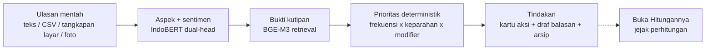
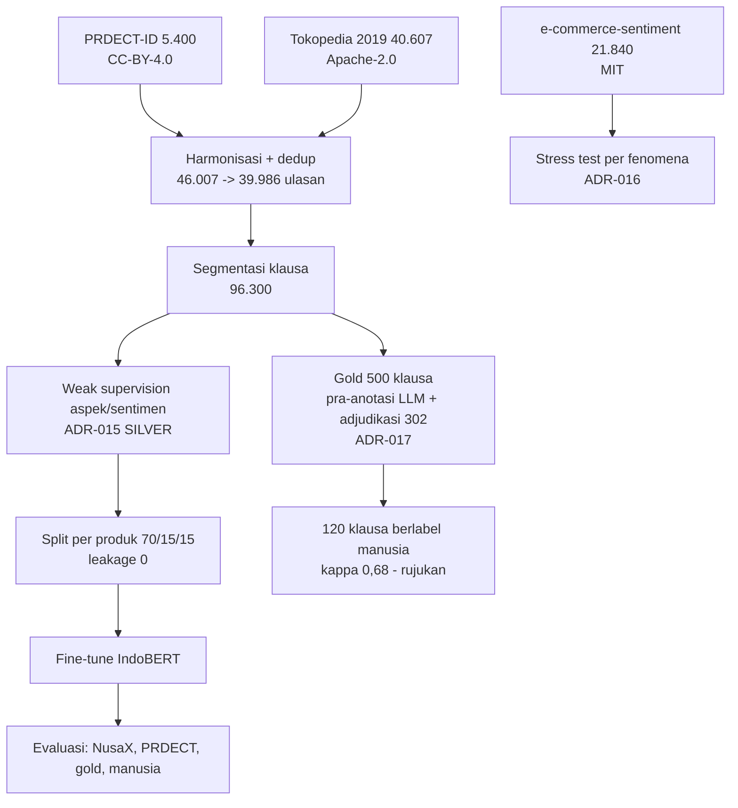
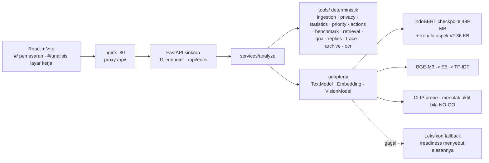

# Panduan Penulisan Laporan (Proposal) Ulasin - AIC COMPFEST 18

> Dokumen tunggal untuk menulis proposal PDF babak penyisihan. Disusun 23 Agustus 2026 dari
> kondisi repositori yang sebenarnya (commit `8aed58a`, 85 commit sejak 5 Agustus, 364 test,
> 11 endpoint, demo publik di 34.41.49.44). **Setiap angka di sini punya berkas asalnya** di
> repositori; tidak ada satu pun angka yang ditulis dari ingatan. Kalau ada keraguan, berkas
> asalnya menang atas dokumen ini.
>
> Cara memakai: bab 1 menjelaskan apa yang dinilai dan strateginya; bab 2-10 adalah bahan per
> bagian proposal (urutannya = urutan wajib rulebook); bab 11 referensi siap kutip; bab 12-15
> lampiran, gambar, gaya, dan checklist ekspor. Blok berlabel **"Kalimat siap pakai"** boleh
> disalin langsung.

---

## 0. Aturan keras yang tidak boleh terlewat

| Aturan (rulebook) | Konsekuensi |
| --- | --- |
| Deadline pengumpulan **25 Agustus 2026, 23.55 WIB**, via situs COMPFEST | Tidak submit = dianggap mundur |
| Proposal PDF **maksimal 20 halaman** di luar cover, daftar pustaka, lampiran | Lewat = risiko pengurangan nilai / ditolak |
| Bagian WAJIB: nama kelompok & judul inovasi · latar belakang · tujuan & manfaat · metodologi (alur dataset, alur pengembangan model **tiap fitur**, alur integrasi ke kode) · metode pendukung keputusan · kesimpulan | Struktur = poin pertama rubrik proposal |
| **Dilarang menunjukkan latar belakang institusi pendidikan dalam bentuk apa pun** | Cek cover, header/footer, nama berkas, metadata PDF, watermark templat, tangkapan layar dengan nama akun |
| Model boleh pre-trained tetapi **wajib di-fine-tune** | Tulis eksplisit: IndoBERT-base di-fine-tune pada 96.300 klausa (MODEL_CARD §3.2) |
| Proposal **bebas plagiarisme** | Kutip sumber; semua angka bersumber |
| Semua fitur di video promosi wajib ada di video PoW; PoW tanpa cut | Selaraskan daftar fitur proposal ↔ video |
| Submisi boleh berkali-kali; yang dinilai **submisi terakhir** | Submit versi lengkap pertama pagi 25 Agu, perbaiki sesudahnya |

---

## 1. Apa yang dinilai, dan strategi per kriteria

### 1.1 Rubrik penyisihan (total 105%)

| Kriteria | Bobot | Pertanyaan rubrik (parafrase) | Bab proposal yang menjawab |
| --- | --- | --- | --- |
| Implementasi Teknologi & Kematangan Arsitektur | **25%** | pilihan teknologi proporsional? core inference bersih, parameter jelas? modular AI/BE/FE? README cukup? | Metodologi §5.2-5.3, §6, §7 |
| Orisinalitas & Dampak Sosial | **20%** | unik? pendekatan baru? beda dari yang ada? relevan & urgent? sesuai target pengguna? | Latar belakang §3, Tujuan §4, §8 |
| Kesiapan MVP untuk Final | 15% | tidak overbuilt/underbuilt? cukup untuk dievaluasi & dikembangkan? arsitektur fleksibel? tim tahu area yang masih bisa ditingkatkan? | §9, Kesimpulan §10 |
| Video Promosi | 15% | (di luar proposal) | - |
| **Kualitas Proposal & Proses Pengembangan** | **15%** | struktur lengkap? metodologi jelas/rinci/logis? keputusan teknologi/model/arsitektur beralasan data? **cerita iteratif reflektif, bukan katalog fitur?** | Seluruh dokumen, terutama §5.4 dan §6 |
| Relevansi Tema | 10% | sesuai tema? AI relevan, tidak dipaksakan? | §3, §4 |
| Business Value & Governance (bonus) | 3,5% | model bisnis / kelayakan adopsi realistis? regulasi, etika, sistem cerdas bertanggung jawab? | §8 |
| AIC Talks (bonus) | 1,5% | presensi 25 Juli | - |

### 1.2 Strategi yang menentukan nilai

1. **Tulis jejak berpikir, bukan daftar fitur.** Pola yang dicari juri:
   `Kami mencoba A → hasilnya kurang karena X (angka) → kami evaluasi → kami pilih B → lebih sesuai karena Y (angka)`.
   Proyek ini punya **sepuluh** cerita semacam itu yang benar-benar terjadi, berangka, bertanggal (§5.4).
2. **Gate yang gagal ditulis sebagai gagal.** Aspek TIDAK LULUS, visual NO-GO, threshold tuning yang
   hipotesisnya keliru, pembacaan LLM yang mengalahkan model sendiri - semuanya ditulis. Rubrik
   MVP eksplisit menghargai tim yang tahu kelemahannya; panitia dapat memeriksa repositori.
3. **Pisahkan terukur dari asumsi, secara visual.** Pakai label `[TERUKUR]`, `[ASUMSI]`,
   `[LAPORAN INDUSTRI]` seperti di BUSINESS_VALUE §0. Satu baris "belum diukur" menaikkan
   kredibilitas tiga baris lain.
4. **Satu kalimat titik pembeda** muncul di halaman pertama dan diulang di kesimpulan:
   > Ulasin membaca 100% ulasan pelanggan, menunjuk tiga hal yang harus dikerjakan minggu ini,
   > dan membuktikan setiap angkanya - sampai juri bisa mengalikannya sendiri.
5. **Hindari kata "dashboard"** untuk produk sendiri (pakai "halaman hasil analisis" / "layar
   kerja") - rulebook membatasi ruang lingkup penyisihan dan kata itu memancing tafsir *overbuilt*.
6. **Jangan buka dengan "UMKM adalah tulang punggung ekonomi"** - 30 tim lain akan. Buka dengan
   toko konkret dan angka konkret (§3.0).

---

## 2. Identitas: nama kelompok, nama inovasi, satu kalimat

| Isi | Nilai |
| --- | --- |
| Nama tim | `[ISI: nama tim terdaftar di COMPFEST, maks 30 karakter]` |
| Nama inovasi | **Ulasin** (sebelumnya InsightUlasan; penggantian merek 21 Agu 2026) |
| Subtema | **Smart Commerce** - sisi konsumen, sales operasional, transaksi komersial |
| Tagline produk | "Sulap ulasan jadi keputusan" |
| Satu kalimat | Ulasin membaca 100% ulasan pelanggan UMKM berbahasa Indonesia informal, menunjuk tiga hal yang harus dikerjakan minggu ini beserta kutipan buktinya, dan membuka rumus di balik setiap angkanya. |
| Anggota | `[ISI nama lengkap 3-5 anggota; TANPA institusi]` - penulis commit di repo: Mikael, Patrick, Raphael |
| Repositori | https://github.com/MikaelAdikara/BPS_AIC (publik) |
| Demo publik | http://34.41.49.44 (VM 2 vCPU, auto-deploy dari `main`) |
| Checkpoint model | https://huggingface.co/MikaelAdi/insightulasan-nlp01 (Apache-2.0, 499 MB) |
| Lisensi kode | lihat `LICENSE` di repo |
| Periode pengerjaan | 5 - 25 Agustus 2026 (di dalam jendela rulebook 17 Jun - 25 Agu); 85 commit, 100% Conventional Commits |

**Kalimat siap pakai (pembuka halaman 1):**
> Ulasin adalah asisten analisis ulasan untuk penjual mikro-kecil di marketplace Indonesia. Ia
> menerima ulasan apa adanya - tempel teks, berkas ekspor, atau tangkapan layar - lalu
> mengembalikan daftar pendek hal yang paling mendesak diperbaiki, masing-masing dengan kutipan
> ulasan asli sebagai bukti dan rumus perhitungan yang dapat diperiksa ulang. Seluruh model
> berjalan lokal di CPU, tanpa API berbayar, dan tidak menyimpan data pengguna.

---

## 3. Latar belakang (jatah ±3 halaman) - menentukan 20% Orisinalitas & Dampak + 10% Relevansi

### 3.0 Pembuka yang disarankan (konkret, bukan makro)

> Sebuah toko fesyen di Shopee menerima 66 ulasan antara Oktober 2025 dan Agustus 2026 dengan
> rata-rata 2,88 bintang. Pemiliknya membaca beberapa yang teratas. Yang tidak pernah terbaca:
> 13 pembeli mengeluhkan kualitas bahan, 7 mengatakan barang tidak sesuai deskripsi, dan 7 lagi
> tidak pernah dibalas chatnya - pola yang baru terlihat ketika seluruh 66 ulasan dibaca
> sekaligus. (Sumber: analisis Ulasin atas `data/samples/demo_shopee_asli.csv`, 23 Agu 2026.)

Lalu perbesar ke pasar (3.1), titik sakit (3.2), celah solusi (3.3), dan kenapa AI (3.4).

### 3.1 Besaran pasar - semua bersumber (pakai label sumber)

| Angka | Nilai | Sumber | Label |
| --- | --- | --- | --- |
| Unit usaha e-commerce Indonesia (2024) | **4,40 juta**, +15,3% setahun, +86% dalam 4 tahun, mayoritas mikro | BPS, Statistik E-Commerce 2024 | STATISTIK RESMI |
| Populasi UMKM (2025) | **65,5 juta** unit · **61,9% PDB** · ~119 juta tenaga kerja (97%) | Kementerian Koperasi dan UKM, 2025 (ukmindonesia.id; linkumkm.id) | STATISTIK RESMI |
| UMKM onboarding digital | ~**25 juta** dari target 30 juta | Kemenkop UKM 2025 | STATISTIK RESMI |
| GMV ekonomi digital Indonesia 2025 | **≈ US$100 miliar**, +14%; e-commerce kontributor terbesar | e-Conomy SEA 2025 (Google-Temasek-Bain, Nov 2025) | LAPORAN INDUSTRI |
| Video commerce 2025 | 2,6 miliar transaksi (+90%), **800 ribu penjual** (+75%) | e-Conomy SEA 2025 | LAPORAN INDUSTRI |
| Biaya platform yang ditanggung penjual (2026) | komisi **2,5-10%** (hingga 12,2% di TikTok Shop/Tokopedia), gratis ongkir **4-4,5%**, promosi 1-2%, iklan 3-5% → **15-20%** dari harga jual; struktur baru berlaku **1 Januari 2026** | Rincian tarif Shopee/Tokopedia/TikTok Shop 2026 (Finpay, Duoke, Webekspor, Taxindo, Kompas) | LAPORAN INDUSTRI |
| Pengaduan konsumen BPKN | **1.733 (2024), naik 200%** dari 926 (2023); e-commerce sektor teratas setelah jasa keuangan; 2025: 851 pengaduan dengan potensi kerugian Rp438,3 M; keluhan utama barang tidak sesuai/rusak, garansi, purna jual | BPKN statistik pengaduan; Antara 2025; Koran Jakarta Des 2025 | STATISTIK RESMI |
| Perilaku pembeli | **>80%** konsumen Indonesia membaca ulasan daring sebelum membeli; **60%** menyebut ulasan jujur sesama pengguna sebagai konten paling meyakinkan (lebih tinggi dari Singapura & Thailand) | Survei perilaku konsumen 2025 (Medcom/Media Indonesia); jurnal perilaku konsumen Indonesia 2025 | SURVEI |
| Efek membalas ulasan | Membalas ulasan → **+12% volume ulasan, +0,12 bintang** rata-rata | Proserpio & Zervas, *Marketing Science* 36(5), 2017; HBR 2018 | PENELITIAN |

**Kalimat siap pakai (penghubung ke urgensi):**
> Empat hal terjadi bersamaan pada 2025-2026: biaya berjualan naik, pengaduan konsumen melonjak,
> pembeli makin bergantung pada ulasan, dan membalas ulasan terbukti berdampak. Keempatnya
> menunjuk ke tumpukan teks yang sama - ulasan pelanggan - yang belum pernah dibaca sistematis
> oleh penjual mikro mana pun, karena waktunya habis untuk berjualan.

### 3.2 Titik sakit - dari sudut pandang orangnya

Persona (dari dossier riset §7.2, boleh dipakai): **"Bu Rina"**, penjual fesyen mikro dua
karyawan, dua toko (Shopee + Tokopedia), ±300 ulasan/bulan, membaca ulasan "kalau sempat", tidak
punya Excel, membalas ulasan negatif hanya yang paling keras. Tiga kerugian yang tidak ia lihat:
(1) keluhan yang berulang pelan-pelan ("agak kekecilan" di 1 dari 10 ulasan) tak pernah jadi
pola; (2) biaya iklan terbakar mendatangkan pembeli ke masalah yang belum diperbaiki; (3) ulasan
negatif tak terbalas menurunkan kepercayaan pembeli berikutnya.

Aritmetika waktu - **tulis dengan pemisahan terukur/asumsi**:

| | Nilai | Status |
| --- | --- | --- |
| Analisis 66 ulasan oleh sistem | **53-55 detik** pada server 2 vCPU tanpa GPU (3 pengukuran: 50, 53, 55 dtk) | TERUKUR |
| Analisis 300 ulasan | ~4-5 menit (ekstrapolasi 0,62 dtk/ulasan + ±47 dtk biaya tetap, sebelum batching; lebih cepat sesudahnya) | TURUNAN |
| Baca & rekap 300 ulasan manual | ~2,7 jam (20 dtk/ulasan + 1 jam rekap) | ASUMSI, belum divalidasi (BUSINESS_VALUE §9) |

### 3.3 Solusi yang sudah ada, dan di mana persisnya mereka berhenti

Gunakan tabel README §3.2 apa adanya (pesaing **bernama**): Shopee Seller Centre / Tokopedia
Seller Dashboard / TikTok Shop Seller Center (gratis; berhenti di rating rata-rata, tanpa aspek,
tanpa prioritas, per kanal) · Yotpo (dari USD 79/bln; pengumpul ulasan, bukan analisis keluhan,
Inggris) · Birdeye (USD 299-449/bln per lokasi + onboarding USD 500-1.500; multi-lokasi, Inggris)
· Thematic (dari USD 2.000/bln; ekstraksi tema kelas perusahaan, Inggris) · Jubelio/Ginee
(operasional multichannel, bukan insight) · baca manual · keyword/rule-based · zero-shot LLM API
(tidak reproducible tanpa API key, tidak konsisten antar run, data keluar).

**Celah, dinyatakan tegas (siap pakai):**
```
Yang gratis  → berhenti di rating rata-rata, tanpa aspek dan tanpa prioritas
Yang mampu   → Rp1,26-32 juta/bulan, dan dirancang untuk ulasan berbahasa Inggris
Di antara keduanya, untuk "bahannya oke sih cuma kekecilan bgt, sizechartnya ngaco",
pada anggaran penjual mikro - tidak ada apa pun.
```

### 3.4 Kenapa AI diperlukan - argumen berangka, bukan asumsi

Bukti dari data sendiri (96.300 klausa; stress test per fenomena linguistik, MODEL_CARD §3.1):
pendekatan kecocokan permukaan (leksikon/TF-IDF) menangani variasi permukaan dengan baik -
typo/informal **0,736**, slang **0,789**, singkat/samar 0,778 - tetapi **runtuh pada fenomena
komposisional**: sentimen campuran **0,113**, negasi **0,163**, sarkasme **0,198**, ambigu 0,237.
Fine-tuning IndoBERT menutup celah negasi (+0,397 → 0,559) dan sentimen campuran (+0,198), tetapi
**tidak** sarkasme (0,198 → 0,179) - dan keduanya ditulis apa adanya. Itulah definisi operasional
"kenapa model kontekstual, bukan aturan": bukan karena tren, karena celahnya terukur.

**Kalimat siap pakai (relevansi tema, 10%):**
> Tema AIC 2026 menempatkan Smart Commerce pada sisi konsumen, sales operasional, dan transaksi.
> Ulasan pelanggan adalah titik tempat ketiganya bertemu: ia ditulis konsumen, dibaca calon
> pembeli, dan menentukan apakah transaksi berikutnya terjadi. AI di sini tidak dipaksakan - ia
> dipakai tepat di bagian yang terbukti tidak bisa ditangani aturan: bahasa informal yang
> komposisional.

---

## 4. Tujuan dan manfaat (jatah ±1,5 halaman)

### 4.1 Tujuan

1. Mengubah ulasan pelanggan berbahasa Indonesia informal menjadi **daftar prioritas tindakan**
   yang berbukti, untuk penjual mikro-kecil tanpa keahlian data.
2. Memastikan **setiap angka dapat diaudit**: dihitung deterministik, dilengkapi kutipan asli, dan
   rumusnya terbuka di antarmuka (fitur "Buka Hitungannya").
3. Berjalan **lokal di CPU tanpa API berbayar**, tanpa akun, tanpa menyimpan data pengguna -
   sehingga dapat direproduksi juri dan dipakai UMKM dengan ongkos mendekati nol.
4. Menyediakan jembatan dari wawasan ke tindakan: **draf balasan** ulasan negatif (keputusan tetap
   di manusia) dan **arsip antar-periode** untuk melihat apakah perbaikan berdampak.

### 4.2 Target pengguna (BUSINESS_VALUE §2)

Segmen 1 (fokus): penjual mikro-kecil online, 1-2 orang, 50-500 ulasan/bulan, anggaran perkakas
~nol. Segmen 2 (jalur distribusi): pendamping UMKM dari dinas/inkubator. Segmen 3 (belum
dilayani penuh): merek menengah multi-SKU (perlu integrasi langsung).

### 4.3 Manfaat - janji, ukuran pembukti, status (pakai tabel ini apa adanya)

| Janji | Ukuran pembukti | Status |
| --- | --- | --- |
| Keluhan terbaca 100%, bukan sampel | Laporan menampilkan n/n; 66 dari 66 di studi kasus | TERUKUR |
| Prioritas terurut, bukan daftar | Skor = frekuensi × keparahan × (1+0,3 tren+0,2 selisih) × 100; terbuka per kartu | TERUKUR (bobot 0,3/0,2 belum divalidasi) |
| Setiap angka berbukti kutipan | 3 kutipan/kartu dengan id ulasan, rating, tanggal, skor relevansi | TERUKUR |
| Bahasa informal terbaca | Macro F1 sentimen 0,730 vs leksikon 0,700 pada label manusia independen; kelas netral 0,021→0,645 | TERUKUR |
| Hemat waktu | 66 ulasan / 53 dtk terukur; pembanding manual belum diuji | SEBAGIAN |
| Tidak menyimpan data | Tidak ada database; sesi in-memory ber-TTL; arsip milik pengguna tanpa teks ulasan (0 dari 66 bocor, diuji) | TERUKUR |
| Rekomendasi benar-benar berguna | Agregat Terima/Tolak pada pemakaian nyata | BELUM DIUKUR |

---

## 5. Metodologi (jatah ±8 halaman) - porsi terbesar

### 5.1 Alur memperoleh dataset (±1,5 halaman)

Diagram (buat sebagai gambar; teks mermaid di §13):
```
3 dataset publik berlisensi  →  pengumpulan  →  cleaning + harmonisasi skema
→ segmentasi klausa  →  pelabelan weak supervision (ADR-015)  →  split product-level 70/15/15
→ 39.986 ulasan → 96.300 klausa  →  gold test set 500 klausa (ADR-017)  →  validasi manusia 120 klausa
+ data segar: 66 ulasan Shopee asli (scraping sendiri, anonimisasi) + 97 foto ulasan berlabel manusia
```

| Dataset | Sumber | Lisensi | Ukuran | Peran |
| --- | --- | --- | --- | --- |
| PRDECT-ID (Sutoyo dkk., *Data in Brief* 2022) | HF `ZakyF/PRDECT-ID` | CC-BY-4.0 | 5.400 ulasan, 29 kategori, label sentimen biner + emosi 5 kelas | latih inti + gold; evaluasi in-domain berlabel manusia (split test n=804) |
| Tokopedia Product Reviews 2019 | HF `farhamu/tokopedia-product-reviews-2019` | Apache-2.0 | 40.607 ulasan, 5 kategori, rating 1-5 (tanpa label sentimen) | latih + uji domain |
| e-commerce-sentiment-bahasa-indonesia | HF `AIbnuHibban/...` | MIT | 21.840 baris | **stress test** per fenomena linguistik, bukan latih (ADR-016: 87% duplikat, kelas seimbang artifisial, label = rating) |
| NusaX-senti (Winata dkk., 2023) | HF | CC-BY-SA-4.0 | 400/bahasa, 3 kelas, expert-labeled | evaluasi sentimen lintas bahasa/domain |
| Ulasan Shopee asli | scraping sendiri (Apify), 2 produk fesyen | - | 66 ulasan teks (anonim) + 97 foto berlabel manusia | demo nyata; gerbang visual; validasi aspek |

Profil data (DATASET_CARD §3): PRDECT 5★ 40% / 1★ 34%; Tokopedia 5★ 75%; ≥1 aspek terdeteksi
84% / 75%; rata-rata 1,79 / 1,37 aspek per ulasan. Harmonisasi: 46.007 ulasan masuk → buang
kosong/pendek 652, duplikat 5.369 → **39.986 ulasan bersih → 96.300 klausa**; sebaran sentimen
klausa positif 84% / negatif 13% / netral 2%; 45% klausa tanpa aspek (label sah, dipakai sebagai
negatif). Split **per produk** (train 69.800 klausa / 3.329 produk), leakage terverifikasi 0.

Pelabelan (ADR-015, weak supervision): aspek 11 kelas multi-label dari labeling function leksikon
per klausa (istilah topik dipisah tegas dari polaritas) → **SILVER**; sentimen klausa dari leksikon
polaritas + negasi dengan prior ulasan; severity heuristik dari rating. **Konsekuensi yang
diakui di muka:** metrik pada silver berisiko sirkular (model memulihkan aturan pembuat labelnya).
Penengahnya: gold set 500 klausa (ADR-017: pra-anotasi LLM, 302 baris diadjudikasi manusia,
kesepakatan aspek persis 56,4%) dan - terbaru - **120 klausa berlabel manusia independen**
(§5.4 #8).

Kenapa tidak pakai dataset ABSA yang ada: delapan variasi kueri di HuggingFace tidak menemukan
ABSA Bahasa Indonesia domain e-commerce berlisensi jelas (CASA = ulasan mobil, HoASA = hotel,
`carant-ai/compiled-absa-indonesian` gated tanpa lisensi) - DATASET_CARD §6.

Etika data: ulasan Shopee dianonimkan sebelum disimpan (nama akun tidak pernah ikut; teks melewati
penyaring PII yang sama dengan aplikasi - `scripts/prepare_apify_photos.py`); atribusi CC-BY untuk
PRDECT-ID wajib dicantumkan.

### 5.2 Alur pengembangan model - **tiap fitur** (±2,5 halaman)

Format per fitur: *Masalah → Input → Praproses → Model/Metode → Inferensi → Output → Status/Bukti.*

**NLP-01 Klasifikasi aspek & sentimen (inti).** Input: klausa hasil segmentasi (`ml/text/preprocess.py`,
identik latih-inferensi). Model: IndoBERT-base (Wilie dkk., 2020) dengan **dua kepala** di atas
satu encoder - aspek multi-label 11 kelas (sigmoid, ambang 0,70 dari validasi) dan sentimen 3
kelas (softmax); mean-pooling token non-padding. Latih: 3 epoch, batch 32, lr 2e-5, AdamW +
OneCycleLR, seed 42, 112,8 menit GTX 1650; checkpoint dipilih dari validation F1. Iterasi kedua
setelah labeling function diperbaiki: 2 epoch. Inferensi: batch klausa lintas-ulasan (64),
CPU, maks 32 token. Output: aspek[], sentimen, severity per klausa → agregat per aspek. **Bukti:**
sentimen LULUS (NusaX-id 0,730 vs leksikon 0,700 vs TF-IDF 0,627; netral 0,021→0,645; PRDECT
93,5% akurat pada keputusan positif/negatif); aspek TIDAK LULUS (gold 0,766 ≈ leksikon 0,770;
manusia 0,579 ≈ 0,581). **Kepala aspek v2** (L0', 23 Agu): dilatih ulang di atas encoder beku
dari 411 klausa gold → 0,585 (tidak berbeda bermakna; kualitas_produk 0,567→0,675, kesesuaian
0,622→0,756), dipasang dengan jalan kembali `ASPECT_HEAD=v1`.

**Fallback leksikon.** Jalur deterministik bila checkpoint tidak ada; sistem tetap menjawab dan
`/readiness` menyebut alasannya. Bukti: test `test_dependensi_serving.py`; demo cabut checkpoint.

**RET-01 Bukti kutipan (retrieval).** Input: klausa/ulasan terindeks per sesi. Model: embedding
BGE-M3 (Chen dkk., 2024) → fallback E5 → fallback TF-IDF; MMR anti-duplikat; maks 3 kutipan
per kartu dengan skor relevansi; **menolak menjawab bila bukti tidak memadai**. Output:
`EvidenceCitation` (quote, review_id, rating, tanggal, skor). Catatan jujur: retrieval
mengembalikan ulasan utuh, sehingga "ulasan terkait" pernah menduplikasi kutipan - dicabut.

**ACT-01 Kartu aksi & skor prioritas.** Tool deterministik (ADR-011): `skor = frekuensi ×
keparahan × (1 + 0,3·tren + 0,2·selisih_baseline) × 100`; urgensi tinggi/sedang/rendah (ambang
12/5, dibatasi maks "sedang" bila <15 ulasan); template rekomendasi per (aspek × severity) dengan
`risk_if_recommendation_wrong`. **Keyakinan model dikeluarkan dari rumus (22 Agu)** karena belum
terkalibrasi - tetap dilaporkan di jejak. Bukti: `test_priority.py`, `test_trace.py`.

**BEN-01 Benchmark kategori.** Baseline agregat pra-hitung dari data publik per kategori (mis.
fesyen n=8.939, "other" n=9.442) dengan margin kesalahan dua sisi; di bawah 30 ulasan toko → label
"indikasi awal", tidak mendorong prioritas (ADR-012).

**Jejak perhitungan ("Buka Hitungannya").** `POST /trace`: klausa mentah → agregat → komponen rumus
dengan asal tiap nilai → aritmetika = skor kartu. Bukti: test "komponen jejak dapat dihitung
ulang menjadi skornya".

**Q&A ter-ground (ADR-018).** Penjaga domain berbasis kosakata korpus + daftar kata analitis
(ambang 0,65, diukur: in-domain maks 0,50, out-of-domain mulai 0,75); intent: per-aspek, prioritas,
pujian, persentase, umum; jawaban dari statistik terhitung + retrieval; menolak bila tanpa bukti.
Bukti: pertanyaan "harga saham Telkom" ditolak; tiga pertanyaan wajar yang sempat salah (audit
22 Agu) kini benar.

**Draf balasan ulasan.** `POST /reply-drafts`: template per (aspek × severity), slot dari data
(kata kunci klausa negatif, langkah rekomendasi), variasi via hash `review_id` (deterministik,
tanpa `random`), slot `[keputusan Anda: ganti barang / refund / tidak ada]` untuk keputusan uang;
UI mengunci "Salin" sampai disunting. Dasar literatur: Proserpio & Zervas 2017.

**Arsip & perbandingan antar-periode (tanpa database).** `POST /archive` (agregat saja, 1,5 KB,
0 teks ulasan) dan `POST /compare` (delta per aspek dengan margin kesalahan gabungan dan bendera
`significant`; selisih kecil ditulis "belum berarti"). Konsisten dengan ADR-010.

**ING-10 OCR tangkapan layar / foto kamera.** Tesseract 5.5 (`ind`+`eng`); penyaring perabot
antarmuka berbasis **jarak piksel** (pisah kata >1,5× tinggi huruf; pisah ulasan >1,9× tinggi
baris); hasil selalu draf yang wajib diperiksa; rating manual opsional. Bukti: uji layout
marketplace → 2 ulasan terpisah bersih; gambar polos/non-gambar ditolak ramah.

**VIS-01 Model visual - NO-GO, dan gerbangnya dieksekusi kode.** CLIP ViT-B/32 zero-shot dengan
prompt ensemble + abstention wajib; data 97 foto ulasan Shopee berlabel manusia; ambang dipilih
di split kalibrasi, dilaporkan di split uji, split **per ulasan**. Hasil: argmax 45% < tebakan
sepele 61%; pada split uji selective accuracy 0,786 dengan coverage 0,27; 61% foto normal salah
ditandai bermasalah → **NO-GO**. Tindak lanjut: `VisionModelAdapter` membaca vonis dari artefak
probe dan **menolak aktif** bila bukan GO; linear probe biner "perlu diperiksa" disiapkan untuk
final (L3). Ini cerita proses terkuat kedua setelah pembalikan gate aspek.

**Kalibrasi keyakinan (L1) - status.** `ml/text/calibrate.py` (temperature scaling, Guo dkk. 2017)
sudah ada; adapter membaca suhu dari bundle dan menampilkan angka keyakinan **hanya** bila
`confidence_calibrated` benar. Saat ini belum dijalankan pada checkpoint → angka disembunyikan.

### 5.3 Alur integrasi ke environment kode (±1 halaman)

Arsitektur (ARCHITECTURE §1-3, C4): **Frontend React+Vite** (SPA, hash route `#/` pemasaran dan
`#/analisis` layar kerja) → **nginx** (port 80, proxy `/api/`) → **Backend FastAPI** satu service
sinkron (ADR-008) → lapisan `services/` (orkestrasi) → `tools/` (16 tool contract deterministik:
ingestion, privacy, statistics, priority, actions, benchmark, retrieval, qna, replies, trace,
archive, periods, category, segments, ocr, fusion) → `adapters/` (TextModelAdapter,
EmbeddingAdapter, VisionModelAdapter) → model. Model dimuat sekali saat startup; `/readiness`
baru 200 setelah siap. **11 endpoint**: health, readiness, models, demo/sample, analyze, ocr,
questions, reply-drafts, trace, archive, compare; OpenAPI di `/api/docs`.

Prinsip yang mengikat: (a) angka hanya dari tool deterministik; model bahasa di hilir (tidak
diintegrasikan - sistem berjalan di jalur narasi template yang *dirancang*, ADR-014); (b) gagal
dengan anggun: checkpoint hilang → leksikon; embedding hilang → kartu tanpa kutipan; (c) tanpa
database, sesi in-memory ber-TTL (ADR-010); (d) redaksi PII sebelum apa pun disimpan (0 kebocoran
pada uji nomor HP/email).

Reproducibility: `docker compose up --build` dari fresh clone (diuji; dua bug konteks build
ditemukan & diperbaiki + test konsistensi COPY↔.gitignore↔.dockerignore); checkpoint 499 MB dari
HF Hub (`scripts/download_checkpoint.py`); `scripts/cek_model.py` pemeriksaan kesehatan 4 lapis.
Deployment: VM GCP e2-standard-2, auto-deploy build-dulu-baru-tukar (push → live ±2 menit, terbukti
tahan force-push), batas 400 ulasan/analisis di VM (terukur; bawaan 1.000). **364 test** (unit +
integrasi, termasuk test yang memastikan sistem MENOLAK menjawab tanpa bukti dan arsip tidak membawa
teks ulasan).

### 5.4 Sepuluh iterasi yang benar-benar terjadi (±2,5-3 halaman) - **tulis paling serius**

Setiap baris = narasi rubrik. Angka dapat ditelusuri ke `ml/evaluation/experiment_log.md`,
MODEL_CARD, dan log commit.

| # | Kapan | Coba A | Hasil/masalahnya (angka) | Pilih B | Hasilnya | Rujukan |
| --- | --- | --- | --- | --- | --- | --- |
| 1 | 5-6 Agu | Petakan label emosi PRDECT-ID ke 11 aspek | `Emotion` = Happy/Sadness/Anger..., tak berkorespondensi dengan aspek; tak ada ABSA e-commerce ID | Weak supervision + gold set penengah | Pipeline label jalan; risiko sirkular diakui di muka | ADR-015 |
| 2 | 6 Agu | Dataset ke-3 sebagai data latih | 87% duplikat, kelas seimbang artifisial, label = rating | Jadikan stress test per fenomena | Melahirkan tabel fenomena (§3.4) yang jadi argumen inti | ADR-016 |
| 3 | 9 Agu | Manusia melabeli 500 gold dari nol | 3-4 jam, penghambat tunggal seluruh angka | Pra-anotasi LLM + adjudikasi 302 baris + 40 kontrol | Beban −40%, keputusan tetap manusia; menyingkap 3 bug labeling function | ADR-017 |
| 4 | 8-9 Agu | Gate Fase 2 dinyatakan GO dari silver (aspek 0,985) | Silver = kecocokan dengan LF; pada gold 7/11 kelas **identik 3 desimal** dengan leksikon | **Verdict dibalik**, label diperbaiki, latih ulang | Sentimen LULUS 0,730 vs 0,700; aspek TIDAK LULUS - ditulis | E04→E06 |
| 5 | 9 Agu | Turunkan ambang negatif (Fase 8) untuk recall kelas negatif | Within noise; 88% negatif yang lolos diprediksi p<0,10 - model yakin saat salah | **Tidak diterapkan**; hipotesis ditulis keliru | Masalahnya bukan ambang, tapi kalibrasi/label → L1, L2 | LIMITATIONS "Fase 8" |
| 6 | 11 Agu | CLIP zero-shot untuk kondisi barang | Argmax 0,45 < tebakan sepele 0,61; 61% foto normal salah ditandai | **NO-GO**; gerbang dieksekusi kode; probe biner disiapkan | Pengguna tidak dikirim memeriksa barang yang baik | visual_gate.json |
| 7 | 9-18 Agu | Q&A stub selalu menolak saat orchestrator belum ada | Melanggar ADR-014 (fallback hanya boleh beda di narasi) | Jawab dari statistik + retrieval; lalu audit 22 Agu: 3/6 pertanyaan wajar salah → intent prioritas/pujian/persentase | Q&A hidup & benar pada konfigurasi nyata | ADR-018 |
| 8 | 22 Agu | Validasi aspek: siapa yang melabeli? LLM saja = ADR-017 ulang | Rancang susunan LLM (bendera ragu) + **manusia pada 60 ragu + 60 kontrol**; rujukan = manusia saja | Kappa 0,683; **"yakin" LLM hanya 53% (CI 41-65%) cocok** → rujukan manusia terbukti perlu; IndoBERT 0,579 ≈ leksikon 0,581; gold 0,704 vs manusia | Gerbang aspek TIDAK LULUS terkonfirmasi; gold bukan penyebabnya | MODEL_CARD §3.3b |
| 9 | 22 Agu | Keyakinan softmax (0,96-0,999) sebagai pengali prioritas | Angka yang sengaja disembunyikan diam-diam mengatur urutan kartu | Dikeluarkan dari rumus; dilaporkan "tidak dikalikan" di jejak | Konsistensi "angka tidak dikarang" | priority.py, SCOPE_FREEZE amendemen |
| 10 | 23 Agu | L0': latih ulang kepala aspek dari label semantik (protokol pra-registrasi, TEST = 120 manusia) | Macro 0,585 vs 0,579 - dalam noise; CV 0,764 vs TEST 0,585 = gold≠manusia ~30% | Dipasang karena unggul di aspek tersering (kualitas +0,11, kesesuaian +0,13), dengan rollback | Gerbang tetap TIDAK LULUS; jalan: lebih banyak label manusia (L0' tahap 2) | MODEL_CARD §3.3c |

Tambahan cerita rekayasa yang menunjukkan kematangan (boleh satu paragraf): bug deployment diam
(checkpoint tidak termuat karena import `pandas` dari modul pelatihan → sistem "siap" dengan
leksikon tanpa peringatan) → dipisahkan `ml/text/model.py`, fallback kini melaporkan alasan di
`/readiness`, test dependensi serving; bug surrogate emoji menjatuhkan batch → ditangani di
ingestion; timeout klien 60 dtk vs nginx 300 dtk → disamakan. Setiap bug punya test regresi.

**Kalimat siap pakai (nomor 4 - cerita terkuat):**
> Pada 8 Agustus kami menyatakan gate model teks LULUS: macro F1 aspek 0,985. Sehari kemudian,
> ketika model yang sama dievaluasi pada gold set, tujuh dari sebelas kelas aspek menghasilkan
> F1 yang identik sampai tiga desimal dengan leksikon pembuat labelnya. Angka 0,985 bukan
> akurasi - ia kecocokan model dengan aturan yang membuat labelnya. Kami membalik verdict kami
> sendiri, memperbaiki labeling function, melatih ulang, dan melaporkan hasilnya apa adanya:
> sentimen lulus pada label manusia independen (0,730 vs 0,700), aspek tidak.

---

## 6. Metode pendukung pengambilan keputusan (jatah ±3 halaman)

### 6.1 Perbandingan baseline (angka yang boleh dikutip - hanya dari label independen/manusia)

| Evaluasi | Leksikon | TF-IDF+LR | IndoBERT | Catatan |
| --- | --- | --- | --- | --- |
| Sentimen, NusaX-senti Indonesia (expert, 3 kelas) | 0,700 | 0,627 | **0,730** | kelas netral 0,021 → 0,645 |
| Sentimen, NusaX Jawa / Inggris / Sunda / Minang | 0,477 / 0,298 / 0,355 / 0,434 | - | 0,517 / 0,469 / 0,388 / 0,468 | lintas domain; semua pendekatan buruk pada bahasa daerah - ditulis |
| Sentimen, PRDECT-ID test biner (n=804) | 0,832 | 0,854 | **0,851** | model memprediksi netral 13,9% (skema biner menghukumnya); pada 692 keputusan pos/neg **akurasi 93,5%**; 91 dari 112 netral sebenarnya keluhan → under-recall negatif diakui |
| Stress test fenomena (sarkasme/negasi/slang) | 0,720 (TF-IDF) | - | 0,730 → **0,770** (iterasi 2) | sarkasme tetap ~0,18-0,20 |
| Aspek, gold 500 (ADR-017) | 0,770 | 0,763 | 0,766 | setara |
| Aspek, 120 klausa manusia | 0,581 | 0,585 | 0,579 (v1) / **0,585** (v2) | gold-LLM 0,704; LLM zero-shot 0,660 |
| Visual, 97 foto (zero-shot CLIP) | tebakan sepele 0,61 | - | argmax 0,45; selective 0,786 @ coverage 0,27 | NO-GO |

Jangan kutip `silver_*` (0,938/0,985) sebagai capaian - hanya sebagai ilustrasi sirkularitas.

### 6.2 Keputusan teknologi & arsitektur yang beralasan data (18 ADR)

Inti yang harus diceritakan: **ADR-001** local-first vs API komersial (reproducibility juri,
kustomisasi nyata lewat fine-tuning, ongkos marginal ~Rp1.330/penjual/bulan, data tidak keluar);
**ADR-002** IndoBERT-base (kosakata & pralatih Indonesia; lebih ringan dari XLM-R untuk CPU);
**ADR-004** visual zero-shot beku (data berlabel visual belum cukup - dan hasilnya NO-GO, jujur);
**ADR-005** BGE-M3 (multibahasa, kuat pada teks pendek; fallback E5/TF-IDF); **ADR-010** tanpa DB;
**ADR-011** skor deterministik; **ADR-013** tanpa eksekusi otomatis; **ADR-014** FALLBACK wajib;
**ADR-015-018** lahir saat implementasi ketika asumsi terbukti salah (bukti proses, bukan
rencana). Sebutkan pula *alternatif yang ditolak*: XLM-R/mBERT (lebih berat, tanpa keunggulan
in-domain), LLM API untuk inferensi (tidak reproducible, tidak deterministik, data keluar), vector
DB terpisah (indeks hidup per sesi; Chroma tidak perlu), database pengguna (privasi + ruang lingkup).

### 6.3 Protokol evaluasi yang mengikat

- Tiga jenis angka dibedakan namanya: `silver_*` (tidak boleh dikutip), `stress_*` (diagnostik),
  gold/manusia (boleh). README §11.
- Split per produk / per ulasan (bukan per klausa/foto) untuk mencegah kebocoran near-duplicate.
- Gate go/no-go per fase dengan kriteria yang ditulis **sebelum** angka dilihat; L0' dan gerbang
  visual memakai protokol pra-registrasi; ambang dipilih di split kalibrasi, dilaporkan di split uji.
- Baseline sepele selalu dihitung (tebakan mayoritas) - yang menggagalkan visual.
- Selang kepercayaan pada n kecil (Wilson 95%) alih-alih satu angka.
- Kappa antar-pelabel dihitung dan aspek dengan kappa < 0,40 **tidak ditafsirkan**.

### 6.4 Analisis kesalahan yang menuntun keputusan produk

Stratifikasi menurut asal label (MODEL_CARD §3.2 catatan 3): klausa dengan sinyal polaritas F1
0,993 vs klausa yang mewarisi sentimen ulasan 0,564 - jurang 0,43 pada model yang sama → aturan
`review_prior` menghasilkan label yang tak dapat dipelajari → diperbaiki (iterasi 2). Matriks
kebingungan PRDECT: 91 negatif → netral vs 21 positif → netral → model kurang berani menyebut
negatif → konsekuensi produk: deteksi keluhan adalah penggerak kartu → masuk roadmap L2 (agregasi
klausa asimetris) dan L1 (kalibrasi).

---

## 7. Hasil yang dapat ditunjukkan (ringkasan untuk tabel satu halaman)

| Dimensi | Bukti |
| --- | --- |
| Produk berjalan | 11 endpoint sinkron, 4 jalur masukan (tempel, CSV/JSON, tangkapan layar, foto kamera), 9 bagian laporan, Q&A, draf balasan, jejak, arsip/compare |
| Demo nyata | 66 ulasan Shopee asli → 5 kartu prioritas + kutipan dalam 53-55 dtk (2 vCPU); kategori tertebak "fashion" (sedang, 17/66) |
| Model | IndoBERT dual-head fine-tuned; sentimen LULUS; aspek TIDAK LULUS (ditulis); kepala aspek v2 |
| Ketahanan | PII 0 bocor; emoji rusak/entitas HTML/CSV multiline ditangani; degradasi bertingkat; gerbang visual dieksekusi kode |
| Kualitas rekayasa | 364 test; 85 commit 100% Conventional Commits; docker compose dari fresh clone; auto-deploy; OpenAPI /api/docs |
| Keterbukaan | MODEL_CARD, DATASET_CARD, LIMITATIONS, RESPONSIBLE_AI, ARCHITECTURE (18 ADR), BUSINESS_VALUE, ROADMAP_FINAL, PITCH, DEPLOYMENT |

---

## 8. Business value & governance (jatah ±2 halaman) - bonus 3,5%

### 8.1 Model bisnis (BUSINESS_VALUE §5-6)

| Tingkat | Isi | Harga |
| --- | --- | --- |
| Gratis (= versi sekarang) | Analisis ad-hoc, tanpa akun, seluruh fitur inti | Rp0 |
| Berlangganan (rencana) | Riwayat lintas periode, multi-toko, ekspor | Rp39.000/bulan **[ASUMSI - belum ada wawancara kesediaan bayar]** |
| Lisensi institusi (rencana) | Instans sendiri untuk pendamping UMKM | dinegosiasi |

Unit economics [TURUNAN dari pengukuran]: VM e2-standard-2 ~USD 54/bulan total; kapasitas
benchmark 66 ulasan/88 dtk (kini ±53) → ~1,94 juta ulasan/bulan pada utilisasi penuh; pada
utilisasi 10% [ASUMSI] dan 300 ulasan/penjual/bulan [ASUMSI] → 648 penjual/instans → **ongkos
marginal ~Rp1.330/penjual/bulan**; biaya API pihak ketiga **Rp0** (ADR-001). Pembanding Birdeye
tier masuk ~Rp4,78 juta/bulan + onboarding.

Kelayakan adopsi (BUSINESS_VALUE §7): 6 dari 7 hambatan terjawab produk yang berjalan (tanpa
akun, tanpa pemasangan, tanpa berkas - cukup foto layar, bahasa sehari-hari, pemandu langkah
pertama, gratis); yang belum: bukti pemakai nyata (pilot). Jalur ke pasar: pendamping UMKM
dinas/inkubator sebagai kanal (segmen 2). Enam hal yang **belum divalidasi** ditulis terbuka
(§9 BUSINESS_VALUE).

### 8.2 Governance & responsible AI (RESPONSIBLE_AI)

- **Privasi by architecture**: tanpa DB, sesi in-memory ber-TTL, redaksi PII sebelum apa pun
  disimpan, arsip tanpa teks ulasan, model lokal - selaras **UU No. 27/2022 (PDP)**; catatan:
  status legal pengambilan data otomatis dari marketplace belum jelas → integrasi langsung
  **tidak dibangun**.
- **Pengawasan manusia**: tidak ada eksekusi tindakan otomatis (ADR-013); setiap kartu Terima/Tolak;
  draf balasan menyisakan `[keputusan Anda]`; OCR selalu draf.
- **Transparansi**: jejak perhitungan, README "Untuk juri: cara memeriksa sendiri", angka keyakinan
  disembunyikan sampai terkalibrasi, gate gagal dipublikasikan.
- **Bias & risiko yang diketahui**: bahasa daerah/Inggris buruk (NusaX 0,39-0,52); sarkasme tidak
  tertangani; under-recall negatif; baseline kategori dari toko besar (belum tentu mewakili mikro);
  taksonomi visual `salah_kirim` sulit dari foto.
- **Threat model** (RESPONSIBLE_AI §3): injeksi lewat isi ulasan tidak berefek karena tidak ada
  LLM di jalur angka; kotak FAQ non-AI tahan injeksi (diuji); batas unggah 5 MB/400 ulasan/10 gambar.

---

## 9. Kesiapan MVP & arah pengembangan (untuk 15% Kesiapan MVP)

- **Tidak overbuilt**: satu alur sinkron (unggah → analisis → hasil), tanpa akun, DB, background job;
  panel-panel = cara membaca satu hasil. **Tidak underbuilt**: alur inti + bukti + jejak + Q&A +
  draf + arsip berjalan dan diuji di produksi.
- **Fleksibel untuk final tanpa perombakan**: kepala aspek v2 dipasang sebagai lapisan (36 KB) tanpa
  mengubah checkpoint; model visual tinggal artefak probe + vonis GO; kalibrasi tinggal suhu di
  bundle; orchestrator narasi tinggal di-plug (ADR-014 menjamin datanya tidak berubah).
- **Area yang diakui masih bisa ditingkatkan signifikan** (ROADMAP_FINAL, berspesifikasi):
  L0' tahap 2 (2-3 ribu label semantik + kontrol manusia → fine-tune penuh); L1 kalibrasi
  (temperature scaling, ECE dilaporkan); L2 agregasi klausa asimetris (memulihkan keluhan pada
  ulasan campuran); L3 probe visual biner pada foto bintang 1-3 baru → L4 kontradiksi foto↔teks;
  L5 sudah dibangun (arsip/compare) → ekspor & tren lanjutan. Rencana hackathon 10 jam: evaluasi
  kelemahan → perbaikan terstruktur → integrasi - persis yang dinilai fase final.

---

## 10. Kesimpulan (±1 halaman) - draf paragraf

> Ulasin menjembatani lima tahap yang selama ini terputus bagi penjual mikro: ulasan mentah →
> aspek & sentimen → bukti → prioritas → tindakan - dengan dua sifat yang membentuk setiap
> keputusan teknisnya: angka tidak pernah dikarang, dan sistem tidak pernah gagal total. Model
> teks yang kami fine-tune terbukti menambah nilai pada sentimen berlabel manusia independen;
> pada aspek, ia belum melampaui aturan leksikon - dan kami yang pertama mengatakannya, lengkap
> dengan validasi manusia dan rencana perbaikannya. Model visual kami gagal gerbangnya sendiri,
> dan gerbang itu kini dieksekusi kode, bukan diingat. Yang kami bawa ke babak final bukan
> produk yang mengklaim sempurna, melainkan produk yang tahu persis di mana ia lemah, punya
> perangkat untuk mengukurnya, dan arsitektur yang memungkinkan perbaikannya tanpa perombakan.

---

## 11. Referensi (siap masuk daftar pustaka; format bebas, konsisten)

**Data & statistik**
- Badan Pusat Statistik. *Statistik E-Commerce 2024*. Jakarta: BPS.
- Kementerian Koperasi dan UKM. Data UMKM 2025 (65,5 juta unit; 61,9% PDB; 25 juta onboarding digital). Dikutip via ukmindonesia.id dan linkumkm.id, 2025.
- Badan Perlindungan Konsumen Nasional. *Statistik Pengaduan* (bpkn.go.id/statistik_pengaduan); Antara News, "BPKN catat tiga sektor utama yang dominasi aduan masyarakat", 2025; Koran Jakarta, 16 Des 2025.
- Google, Temasek, Bain & Company. *e-Conomy SEA 2025*, November 2025 (blog.google; bain.com; temasek.com.sg).
- Rincian biaya administrasi marketplace 2026: Finpay (finpay.id), Duoke, Webekspor, RekapCepat, Taxindo; Kompas.com (biaya platform 15-20%), 2026.
- Survei perilaku konsumen: Medcom/Media Indonesia, "Konsumen Indonesia paling percaya review sesama pengguna" (2025); jurnal perilaku konsumen Indonesia 2025 (>80% membaca ulasan).

**Penelitian**
- Proserpio, D., & Zervas, G. (2017). Online Reputation Management: Estimating the Impact of Management Responses on Consumer Reviews. *Marketing Science*, 36(5), 645-665. (HBR, Feb 2018: "Study: Replying to Customer Reviews Results in Better Ratings".)
- Wilie, B., dkk. (2020). IndoNLU: Benchmark and Resources for Evaluating Indonesian NLU. *AACL-IJCNLP*. (IndoBERT-base, `indobenchmark/indobert-base-p1`.)
- Sutoyo, R., dkk. (2022). PRDECT-ID: Indonesian product reviews dataset for emotions classification tasks. *Data in Brief*, 44. CC-BY-4.0.
- Winata, G. I., dkk. (2023). NusaX: Multilingual Parallel Sentiment Dataset for 10 Indonesian Local Languages. *EACL*.
- Chen, J., dkk. (2024). BGE M3-Embedding: Multi-Lingual, Multi-Functionality, Multi-Granularity Text Embeddings. arXiv:2402.03216.
- Radford, A., dkk. (2021). Learning Transferable Visual Models From Natural Language Supervision (CLIP). *ICML*.
- Guo, C., Pleiss, G., Sun, Y., & Weinberger, K. Q. (2017). On Calibration of Modern Neural Networks. *ICML*. (temperature scaling)
- Ratner, A., dkk. (2017). Snorkel: Rapid Training Data Creation with Weak Supervision. *VLDB*. (weak supervision)
- Cohen, J. (1960). A coefficient of agreement for nominal scales. *Educational and Psychological Measurement*. Wilson, E. B. (1927). Probable inference, the law of succession, and statistical inference. *JASA*. (kappa; selang Wilson)
- Smith, R. (2007). An Overview of the Tesseract OCR Engine. *ICDAR*.
- Kerja terkait ABSA IndoBERT 2025 (hotel, travel, aplikasi) - untuk memosisikan bahwa penelitian berhenti di klasifikasi, tidak sampai prioritas berbukti: mis. JISEBI 2025 (travel UGC), Jurnal Sisfokom 2025 (hotel), BITS (Skintific).

**Regulasi**
- Undang-Undang No. 27 Tahun 2022 tentang Pelindungan Data Pribadi.
- (Opsional) Permendag No. 31/2023 tentang perdagangan melalui sistem elektronik.

**Perangkat lunak** (sebut di lampiran): PyTorch, Transformers, FastAPI, React/Vite, Tesseract, scikit-learn, Docker, nginx; `indobenchmark/indobert-base-p1`; `BAAI/bge-m3`; `openai/clip-vit-base-patch32`.

---

## 12. Lampiran yang disarankan (tidak dihitung dalam 20 halaman)

A. Tabel metrik lengkap per kelas (gold_results.json, external_results.json, aspect_human_results.json, aspect_head_v2_results.json, visual_gate.json).
B. 18 ADR (ringkasan satu baris + konteks untuk 015-018).
C. Kontrak data & API (11 endpoint, skema `AnalysisResult`, `ActionTrace`, `AnalysisArchive`).
D. Formula prioritas + contoh jejak perhitungan nyata (ACT-001: 0,197 × 1,0 × 1,468 × 100 = 28,92).
E. Tangkapan layar: halaman pemasaran (hero, Buka Hitungannya), layar kerja (unggah, proses, laporan), kartu + bukti, jejak, draf balasan, arsip/compare, OCR draf, `/readiness` saat checkpoint dicabut, `/api/docs`.
F. Panduan anotasi gold & aspek (PANDUAN_ANOTASI*.md) dan agreement report.
G. Log eksperimen (experiment_log.md E02-E05) dan protokol L0'.
H. Checklist responsible AI (RESPONSIBLE_AI §1).

---

## 13. Gambar/diagram yang perlu dibuat (teks mermaid siap render)

**G1 - Jembatan lima tahap**


**G2 - Alur dataset**


**G3 - Arsitektur & integrasi**


**G4 - Gerbang & iterasi (timeline 5-23 Agustus)**: garis waktu dengan 10 titik dari §5.4.

**G5 - Tabel fenomena linguistik** (§3.4) sebagai diagram batang baseline vs fine-tuned.

---

## 14. Gaya penulisan, anggaran halaman, dan larangan

| Bagian | Halaman |
| --- | ---: |
| 1 Nama & inovasi | 0,5 |
| 2 Latar belakang | 3 |
| 3 Tujuan & manfaat | 1,5 |
| 4 Metodologi (dataset 1,5 · model per fitur 2,5 · integrasi 1 · iterasi 3) | 8 |
| 5 Metode pendukung keputusan | 3 |
| 6 Business value & governance | 2 |
| 7 Kesimpulan | 1 |
| Cadangan | 1 |
| **Total** | **20** |

Gaya: kalimat aktif, angka selalu dengan asalnya, tabel lebih sering daripada prosa untuk
metrik, satu gambar per halaman metodologi, tidak ada klaim "akurasi 9x%" tanpa label dataset
dan skema. Hindari: "dashboard" untuk produk sendiri; "revolusioner/terobosan"; angka silver
sebagai capaian; klaim integrasi marketplace; klaim video/umpan kamera langsung (sengaja tidak
dibangun - tulis alasannya bila perlu: tidak relevan dengan data ulasan, melanggar batas MVP
sinkron, contoh AI dipaksakan).

Konsistensi dengan artefak lain: fitur yang disebut di proposal = fitur di video PoW; angka
di proposal = angka di MODEL_CARD; nama = **Ulasin** di semua tempat (README sudah; HF repo lama
`insightulasan-nlp01` boleh tetap sebagai nama artefak).

---

## 15. Checklist sebelum ekspor PDF

- [ ] ≤ 20 halaman di luar cover, pustaka, lampiran
- [ ] Tidak ada nama/logo/alamat institusi - cover, header/footer, metadata PDF, nama berkas, tangkapan layar
- [ ] Enam bagian wajib ada dengan judul yang mudah dikenali juri (pakai kata rulebook: "Metodologi - Alur memperoleh dataset", "Alur pengembangan model tiap fitur", "Alur integrasi model ke environment kode", "Metode pendukung keputusan")
- [ ] Tiap angka tertelusur ke berkas di repo (sebut nama berkasnya di catatan kaki/lampiran)
- [ ] Gate gagal tertulis: aspek TIDAK LULUS (gold + manusia), visual NO-GO, threshold tuning tidak diterapkan, L0' dalam noise
- [ ] Angka `silver_*` tidak dikutip sebagai capaian
- [ ] Atribusi CC-BY-4.0 PRDECT-ID, CC-BY-SA NusaX, Apache/MIT dataset lain, lisensi model
- [ ] Klaim kustomisasi = fine-tuning + weak supervision + RAG, bukan tool-calling/LLM API
- [ ] Kalimat titik pembeda ada di hal. 1 dan kesimpulan
- [ ] Bab business value memuat label [ASUMSI]/[TERUKUR]
- [ ] Tautan: repo, demo, HF checkpoint, `/api/docs`
- [ ] Bebas plagiarisme; kutipan literatur ≤ 1 kalimat pendek dengan sumber
- [ ] Versi PDF terakhir = versi yang di-submit; submit pagi, perbaiki siang, commit terakhir < 23.55

---

*Berkas ini adalah peta bahan; kebenarannya mengikuti berkas sumber di repositori (MODEL_CARD,
DATASET_CARD, ARCHITECTURE, LIMITATIONS, RESPONSIBLE_AI, BUSINESS_VALUE, ROADMAP_FINAL, PITCH,
DEPLOYMENT, `ml/evaluation/*.json`, `ml/evaluation/experiment_log.md`).*
